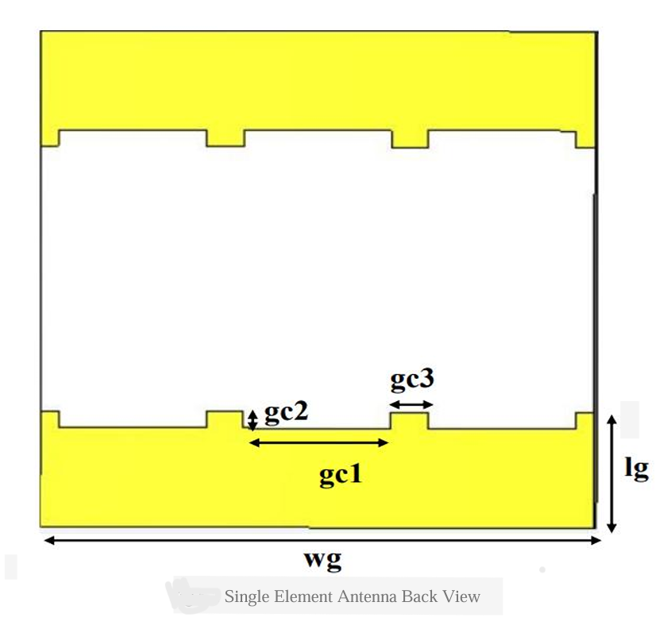

# compact-uwb-mimo-antenna
Design and simulation of a compact Ultra wide band MIMO antenna for wireless communication
# Compact UWB MIMO Antenna

This project involves designing a compact Ultra-Wideband (UWB) MIMO antenna optimized for high-speed wireless communication. The antenna is miniaturized and engineered to offer improved isolation and enhanced bandwidth.

## 📌 Objectives
- Design UWB MIMO antenna
- Improve isolation & ECC
- Simulate and optimize performance using CST Studio

## 📈 Simulation Highlights
- Return Loss (S11)
- Envelope Correlation Coefficient (ECC)
- Radiation Pattern
- Impedance Matching

## 🖼 Screenshots

### Antenna Layout frontview

### Antenna Layout bottomview

## 🛠 Tools Used
- CST Studio Suite

## 🗓 Duration
Oct 2024 – Apr 2025
